# Texas-Tech-University (ECE) ---Enigma-Encryption-Typewriter-Project 
[](https://github.com/deosgracius/Texas-Tech-University---Enigma-Encryption-Typewriter-Project/actions/workflows/c-cpp.yml)

## 📖 Full Reference Guide

[](https://your-username.github.io/your-repo/enigma-complete(2).html)

## System Architecture

[View full system diagram](enigma-system.drawio)

### Full System Diagram

```mermaid
flowchart TD
    %% ─── STATE 1 — POWER ON ─────────────────────────────────────────────────
    BOOT["🟦 STATE 1 · POWER ON
    ━━━━━━━━━━━━━━━━━━━━━━━━━━━
    1. 120MHz PLL + SysTick 1ms
    2. PB4+PB5 blink ×3
    3. UART0 init → PuTTY active
    4. LCD: System Check... 5s
    5. enigma_init UKW-B I-II-III A-A-A
    6. control_panel_init → LCD idle
    7. kb_mitm_gpio_init → PB3 HIGH
    8. plugboard_hw_init
    9. Main loop begins"]

    %% ─── STATE 2 — KEYBOARD SCAN ────────────────────────────────────────────
    KB["🟩 STATE 2 · KEYBOARD SCAN
    ━━━━━━━━━━━━━━━━━━━━━━━━━━━━━━━
    Brother SX-4000 · Passive 8×8 matrix
    28 keys: 26 letters + Space + Return
    ───────────────────────────────────
    FPC1 → 16 wires → MSP432 GPIO inputs
    ───────────────────────────────────
    scan_once():
      Drive row LOW · Hi-Z all others
      Wait 20µs settle
      Read 8 col lines via WPU
      Col reads LOW → key detected
    ───────────────────────────────────
    get_key() debounce:
      2 scans × 20ms gap
      Must match both times
      Returns on key-down, not release
    ───────────────────────────────────
    KB_KEYS[row][col] → char A–Z/SPC/RET"]

    %% ─── STATE 3 — MODE DECISION ────────────────────────────────────────────
    MODE{"🟨 STATE 3
    MODE DECISION
    ━━━━━━━━━━━━━━
    g_currentMode
    BTN_MODE cycles:
    PASS→ENC→DEC"}

    %% ─── STATE 4A — PASSTHROUGH ─────────────────────────────────────────────
    PASS["🟩 STATE 4A · PASSTHROUGH
    ━━━━━━━━━━━━━━━━━━━━━━━━━━━━
    out = key_in
    No cipher applied
    Same letter injected
    LCD: line2 = line3"]

    %% ─── STATE 4B — ENCRYPT ─────────────────────────────────────────────────
    ENC["🟥 STATE 4B · ENCRYPT
    ━━━━━━━━━━━━━━━━━━━━━━━━━━━━━━
    enigma_encrypt_char_traced()
    ─────────────────────────────
    Step 0: Advance rotors first
            double-step anomaly
    Step 1: Plugboard forward
    Step 2: Right rotor forward
    Step 3: Middle rotor forward
    Step 4: Left rotor forward
    Step 5: Reflector UKW-B
    Step 6: Left rotor reverse
    Step 7: Middle rotor reverse
    Step 8: Right rotor reverse
    Step 9: Plugboard return
    ─────────────────────────────
    out = ciphertext character"]

    %% ─── STATE 4C — DECRYPT ─────────────────────────────────────────────────
    DEC["🟪 STATE 4C · DECRYPT
    ━━━━━━━━━━━━━━━━━━━━━━━━━━━━━━
    Same function as ENCRYPT
    Enigma is self-inverse by design
    ─────────────────────────────
    Configure both ends identically
    Enter ciphertext → gets plaintext
    ─────────────────────────────
    out = plaintext character"]

    %% ─── STATE 4D — SPECIAL KEYS ────────────────────────────────────────────
    SPECIAL["🟩 STATE 4D · SPACE / RETURN
    ━━━━━━━━━━━━━━━━━━━━━━━━━━━━━━━
    Bypass cipher — any mode
    Space:  col CBA=111  row CBA=001
    Return: col CBA=110  row CBA=001
    ────────────────────────────────
    Return also:
      → saves message to history
      → resets rotors to Grundstellung
      → clears g_typing_started"]

    %% ─── STATE 5 — CBA LOOKUP ───────────────────────────────────────────────
    CBA["🟧 STATE 5 · CBA LOOKUP
    ━━━━━━━━━━━━━━━━━━━━━━━━━━━━━━━
    OUTPUT_COL[out - 'A']
    OUTPUT_ROW[out - 'A']
    ───────────────────────────────
    3-bit binary address
    C = bit2 MSB
    B = bit1
    A = bit0 LSB
    ───────────────────────────────
    Values verified by oscilloscope
    measurement on FPC2 signals"]

    %% ─── STATE 6 — INJECTION ────────────────────────────────────────────────
    INJECT["🟧 STATE 6 · INJECTION
    ━━━━━━━━━━━━━━━━━━━━━━━━━━━━━━━
    set_cba(col_idx, row_idx)
    ───────────────────────────────
    Port K write → PK0 PK1 PK2 PK3
    Port A write → PA4 PA5
    PM0 KP_LED → HIGH
    ───────────────────────────────
    HOLD LOOP:
      while scan_once() ≠ null
        delay_ms(1)
    Injection held for full
    physical key duration
    ───────────────────────────────
    Key released:
      clear_cba() → all CBA = 0
      PM0 KP_LED → LOW
      INJECT OFF → PuTTY"]

    %% ─── STATE 7 — HARDWARE INJECTION ──────────────────────────────────────
    MUXCOL["🟥 STATE 7A
    CD4051BE Col Mux
    ━━━━━━━━━━━━━━━━━
    PK0 PK1 PK2 → CBA
    Selects 1 of 8
    col lines on FPC2"]

    MUXROW["🟥 STATE 7B
    CD4051BE Row Mux
    ━━━━━━━━━━━━━━━━━
    PK3 PA4 PA5 → CBA
    Selects 1 of 8
    row lines on FPC2"]

    SW["🟥 STATE 7C
    CD4066BD Switch
    ━━━━━━━━━━━━━━━━━
    EN_PIN PB3
    HIGH permanently
    ─────────────────
    Bridges col + row
    → simulates
    key press"]

    %% ─── STATE 8 — PRINTER ──────────────────────────────────────────────────
    PRINTER["🖨️ STATE 8 · PRINTER OUTPUT
    ━━━━━━━━━━━━━━━━━━━━━━━━━━━━━━━
    FPC2 → SX-4000 printer controller
    ───────────────────────────────
    Controller scans FPC2 continuously
    Detects row-col coincidence
    Actuates daisy-wheel mechanism
    ───────────────────────────────
    Character stamped on paper"]

    %% ─── SUPPORT — ENIGMA ENGINE ────────────────────────────────────────────
    ENIGMA["⚙️ ENIGMA ENGINE
    enigma.c
    ━━━━━━━━━━━━━━━━━━━━━
    5 rotors: I II III IV V
    3 reflectors: UKW-A/B/C
    13 plugboard pairs max
    Double-step anomaly
    Inverse tables precomputed
    at boot — O(1) traversal"]

    %% ─── SUPPORT — CONTROL PANEL ────────────────────────────────────────────
    CP["🎛️ CONTROL PANEL
    control_panel.c
    ━━━━━━━━━━━━━━━━━━━━━━━━━
    6-state FSM:
    NORMAL
    → CONFIG_MENU
    → ROTOR_SELECT
    → REFLECTOR_SELECT
    → PLUGBOARD_SELECT
    → RING_SET
    → TYPING
    ─────────────────────────
    5 buttons · 200ms debounce
    Green LED = ENCRYPT
    Red LED   = DECRYPT"]

    %% ─── SUPPORT — LCD ──────────────────────────────────────────────────────
    LCD["📺 LCD
    UART6 PP1 9600 baud
    NHD-0420D3Z 20×4
    ━━━━━━━━━━━━━━━━━
    Line1: mode+rotors
    Line2: plaintext
    Line3: ciphertext
    Line4: config"]

    %% ─── SUPPORT — UART DEBUG ───────────────────────────────────────────────
    UART["💻 UART DEBUG
    PA1 · 115200 baud → PuTTY
    ━━━━━━━━━━━━━━━━━━━━━━━━━━
    [ENC] H→X (7 changes)
     1.Rfwd 2.Mfwd 3.Lfwd
     4.Refl 5.Lrev 6.Mrev 7.Rrev
    [INJECT ON] COL=xxx ROW=xxx
    [INJECT OFF]"]

    %% ─── SUPPORT — PLUGBOARD HW ─────────────────────────────────────────────
    PBHW["🔌 PLUGBOARD HW
    plugboardhw.c · 26 NC jacks
    ━━━━━━━━━━━━━━━━━━━━━━━━━━━━
    Step1: pre-filter
      LOW = empty → skip
      HIGH = cable → candidate
    Step2: drive-LOW confirm
      Drive HIGH pin LOW
      Other follows → pair
    → Apply pairs to EnigmaState"]

    %% ─── TIMING BAR ─────────────────────────────────────────────────────────
    TIMING["⏱️ TIMING — ONE COMPLETE KEY PRESS
    ━━━━━━━━━━━━━━━━━━━━━━━━━━━━━━━━━━━━━━━━━━━━━━━━━━━━━━━━━━━━━━━━━━━━━━━━━━━━━━━━━
    STATE 2         STATE 3      STATE 4        STATE 5     STATE 6          STATE 8
    KEY PRESSED → 20µs settle → SCAN DETECTS → 20ms gap → SECOND SCAN → Enigma <1µs → CBA DRIVEN → held 100–500ms → RELEASED → CBA CLEARED → PRINTED"]

    %% ═══════════════════════════════════════════════════════════════
    %%  CONNECTIONS
    %% ═══════════════════════════════════════════════════════════════

    BOOT  -->|"State 1 → State 2"| KB
    KB    -->|"char detected · State 2 → State 3"| MODE

    MODE  -->|"State 3 → State 4A"| PASS
    MODE  -->|"State 3 → State 4B"| ENC
    MODE  -->|"State 3 → State 4C"| DEC
    MODE  -.->|"SPC/RET any mode → State 4D"| SPECIAL

    PASS    -->|"State 4A → State 5"| CBA
    ENC     -->|"State 4B → State 5"| CBA
    DEC     -->|"State 4C → State 5"| CBA
    SPECIAL -.->|"State 4D → State 5"| CBA

    CBA -->|"State 5 → State 6"| INJECT

    INJECT -->|"State 6 → State 7A · PK0 PK1 PK2"| MUXCOL
    INJECT -->|"State 6 → State 7B · PK3 PA4 PA5"| MUXROW
    MUXCOL -->|"State 7A → State 7C · col line"| SW
    MUXROW -->|"State 7B → State 7C · row line"| SW
    SW     -->|"State 7C → State 8 · FPC2"| PRINTER

    ENIGMA  -.->|"tables used in State 4B/4C"| ENC
    ENIGMA  -.->|"tables used in State 4B/4C"| DEC
    PBHW    -.->|"pairs applied at State 1"| ENIGMA
    CP      -.->|"BTN_MODE → State 3"| MODE
    CP      -.->|"updates at State 4"| LCD
    INJECT  -.->|"trace at State 6"| UART
    ENC     -.->|"9-stage trace"| UART
    DEC     -.->|"9-stage trace"| UART

    INJECT -.->|"timing reference"| TIMING

    %% ═══════════════════════════════════════════════════════════════
    %%  STYLES
    %% ═══════════════════════════════════════════════════════════════

    classDef boot     fill:#e0f2fe,stroke:#0369a1,stroke-width:3px,color:#000
    classDef scan     fill:#dcfce7,stroke:#16a34a,stroke-width:3px,color:#000
    classDef mode     fill:#fef9c3,stroke:#ca8a04,stroke-width:3px,color:#000
    classDef passthru fill:#dcfce7,stroke:#16a34a,stroke-width:2px,color:#000
    classDef encrypt  fill:#fee2e2,stroke:#dc2626,stroke-width:2px,color:#000
    classDef decrypt  fill:#ede9fe,stroke:#7c3aed,stroke-width:2px,color:#000
    classDef special  fill:#f0fdf4,stroke:#16a34a,stroke-width:1px,color:#000
    classDef cba      fill:#fef3c7,stroke:#d97706,stroke-width:3px,color:#000
    classDef inject   fill:#fef3c7,stroke:#d97706,stroke-width:3px,color:#000
    classDef hardware fill:#fee2e2,stroke:#b91c1c,stroke-width:2px,color:#000
    classDef printer  fill:#fee2e2,stroke:#b91c1c,stroke-width:3px,color:#000
    classDef engine   fill:#e0e7ff,stroke:#1e40af,stroke-width:2px,color:#000
    classDef support  fill:#f8faff,stroke:#3b82f6,stroke-width:1px,color:#000
    classDef timing   fill:#fef3c7,stroke:#d97706,stroke-width:1px,color:#000

    class BOOT boot
    class KB scan
    class MODE mode
    class PASS passthru
    class ENC encrypt
    class DEC decrypt
    class SPECIAL special
    class CBA cba
    class INJECT inject
    class MUXCOL,MUXROW,SW hardware
    class PRINTER printer
    class ENIGMA engine
    class CP,LCD,UART,PBHW support
    class TIMING timing
```

# Enigma Encryption Typewriter

> A real-time hardware cryptographic interceptor — the Wehrmacht Enigma I cipher embedded in a working typewriter.

A Texas Instruments **MSP432E401Y** microcontroller sits electrically between the keyboard and print mechanism of a **Brother SX-4000** typewriter. Every key pressed is intercepted, optionally transformed through a verified Enigma I emulation, and re-injected into the printer as a substitute keystroke. The typewriter physically prints the result on paper.


Three modes, selectable at runtime with no power cycle required:

| Mode | What happens |
|---|---|
| **PASSTHROUGH** | Character injected unchanged — normal typing |
| **ENCRYPT** | Enigma transforms plaintext → ciphertext, printer stamps ciphertext |
| **DECRYPT** | Same Enigma function (self-inverse) — ciphertext → plaintext |

Space and Return always pass through unchanged and are never processed by the cipher engine.

---

## Hardware

| Component | Part | Qty | Role |
|---|---|---|---|
| Microcontroller | MSP432E401Y LaunchPad | 1 | 120 MHz ARM Cortex-M4F — scan, cipher, inject, UI, debug |
| Typewriter | Brother SX-4000 | 1 | 8×8 passive keyboard matrix (FPC1) + daisy-wheel printer (FPC2) |
| Analog multiplexer | CD4051BE | 2 | 8-channel mux — one selects FPC2 column, one selects FPC2 row |
| Bilateral switch | CD4066BD | 1 | Gates the col and row mux outputs — enable pin PB3 held HIGH from boot |
| LCD display | NHD-0420D3Z-NSW-BBW | 1 | 20×4 serial character display, UART6 at 9600 baud |
| Push-buttons | Tactile 6mm | 5 | MODE / SELECT / UP / DOWN / ENTER |
| LEDs | 3mm standard | 3 | Green (ENCRYPT), Red (DECRYPT), Keypress indicator |
| Plugboard jacks | 3.5mm mono NC | 26 | One per letter A–Z, normally-closed to GND |
| Resistors | 330 Ω | 3 | LED current-limiting on PB4, PB5, PM0 |
| FPC breakout | Matching SX-4000 | 2 | FPC1 (keyboard side) and FPC2 (printer side) intercept connectors |

> **EN_PIN (PB3)** is the CD4066 bilateral switch enable. It is driven HIGH permanently from boot and never changes. Injection is controlled entirely by the CBA address lines — when CBA is all-zero both multiplexers select an unmapped matrix position, so no character is printed during idle.

---

## Firmware modules

```
main.c            System orchestrator. Startup sequence, keyboard scan,
                  process_key(), main loop.

enigma.c/h        Complete Enigma I cipher engine. 5 rotors, 3 reflectors,
                  dual-stage plugboard, double-step anomaly, traced encryption.

control_panel.c/h 6-state FSM. Button navigation, mode switching, rotor /
                  ring / plugboard config, typing display, history log.

LCD.c/h           NHD-0420D3Z driver. UART6 at 9600 baud, 0xFE command-prefix
                  protocol.

uart_comm.c/h     UART0 debug at 115200 baud. Full per-character trace to
                  PuTTY on every ENCRYPT / DECRYPT key press.

plugboardhw.c/h   26-jack GPIO scan. NC-jack pre-filter + drive-LOW
                  pair confirmation algorithm.

config.h          Single source of truth. Every pin assignment, timing
                  constant, and lookup table. Included by all files.

mitm.h            Legacy stub. Four empty inline functions. Exists only to
                  satisfy the #include in control_panel.c.

system_check.c/h  Boot diagnostics. Validates reflector symmetry and
                  no-fixed-point property at startup.

system_msp432e401y.c  TI SDK device clock and vector table (provided).
```

---

## GPIO pin assignment

### Keyboard scan — column inputs
Active row-drive scan. Columns are **Input + WPU** (idle HIGH, pressed = LOW).

| Pin | Signal | Connector | Letters on this column |
|---|---|---|---|
| PE4 | SCAN_COL0 | J1-2 | B  C  V |
| PC4 | SCAN_COL1 | J1-3 | M  N  X |
| PC5 | SCAN_COL2 | J1-4 | I  K  L  U |
| PC6 | SCAN_COL3 | J1-5 | D  O  P  S |
| PE5 | SCAN_COL4 | J1-6 | H  J  T  Y |
| PD3 | SCAN_COL5 | J1-7 | E  F  G  R |
| PC7 | SCAN_COL6 | J1-8 | A  Q  W  Z  Return |
| PB2 | SCAN_COL7 | J1-9 | Space |

### Keyboard scan — row lines
Toggle between **Hi-Z** (idle) and **Output LOW** (active scan interval).

| Pin | Signal | Connector | Letters on this row | Note |
|---|---|---|---|---|
| PE0 | SCAN_ROW0 | J3-23 | — unused | |
| PE1 | SCAN_ROW1 | J3-24 | Return (col 6)  Space (col 7) | |
| PE2 | SCAN_ROW2 | J3-25 | A  D  G  J  L | |
| PE3 | SCAN_ROW3 | J3-26 | B  I  M  P  R  W  Y | |
| PD7 | SCAN_ROW4 | J3-28 | C  F  H  K  S  X  Z | ⚠ NMI pin — GPIOLOCK unlock required |
| PM1 | SCAN_ROW5 | J8-2  | E  N  O  Q  T  U  V | Moved from PD6 (unreliable) |
| PM4 | SCAN_ROW6 | J3-29 | — unused | |
| PM5 | SCAN_ROW7 | J3-30 | — unused | |

> **⚠ PD7 (NMI pin):** Hardware-locked at reset. All GPIO writes are silently ignored without the unlock sequence. `GPIO_O_LOCK` and `GPIO_O_CR` are **not** defined in the MSP432E4 SDK — raw register offsets from the datasheet must be used:
> ```c
> HWREG(GPIO_PORTD_BASE + 0x520u) = 0x4C4F434Bu;  // write unlock key
> HWREG(GPIO_PORTD_BASE + 0x524u) |= GPIO_PIN_7;  // commit PD7
> HWREG(GPIO_PORTD_BASE + 0x520u) = 0;            // re-lock
> ```

> **PM1 note:** Row 5 was originally PD6. PD6 did not respond to GPIO configuration calls on this hardware instance. Row 5 was reassigned to PM1 (J8 connector pin 2).

### Injection outputs — CBA addresses to CD4051 muxes

| Pin | Signal | Role |
|---|---|---|
| PK0 | OUT_COL_C | Col CBA bit 2 (MSB) → CD4051 col mux pin C *(analog pin — DEN auto-set)* |
| PK1 | OUT_COL_B | Col CBA bit 1 → CD4051 col mux pin B |
| PK2 | OUT_COL_A | Col CBA bit 0 (LSB) → CD4051 col mux pin A |
| PK3 | OUT_ROW_C | Row CBA bit 2 (MSB) → CD4051 row mux pin C *(analog pin)* |
| PA4 | OUT_ROW_B | Row CBA bit 1 → CD4051 row mux pin B |
| PA5 | OUT_ROW_A | Row CBA bit 0 (LSB) → CD4051 row mux pin A |
| **PB3** | **EN_PIN** | CD4066 enable — **HIGH permanently from boot, never changes** |
| PM0 | KP_LED | Keypress indicator — ON while key held, OFF on release |

### Control panel

| Pin | Signal | Function |
|---|---|---|
| PB4 | LED_GREEN | ENCRYPT mode — blinks ×3 at boot |
| PB5 | LED_RED | DECRYPT mode — blinks ×3 at boot |
| PD2 | BTN_MODE | Cycle PASSTHROUGH → ENCRYPT → DECRYPT |
| PQ0 | BTN_SELECT | Confirm selection / advance to next parameter |
| PP4 | BTN_UP | Increment: rotor, position, plugboard day, ring |
| PN5 | BTN_DOWN | Decrement same |
| PN4 | BTN_ENTER | Enter configuration submenus |
| PA0 | UART0_RX | Debug UART receive — 115200 baud 8N1 |
| PA1 | UART0_TX | Debug UART transmit → PuTTY |
| PP1 | UART6_TX | LCD transmit — 9600 baud → NHD-0420D3Z |

### Plugboard jacks A–Z
26 normally-closed 3.5mm mono jacks. **Empty = LOW** (NC contact shorts tip to GND). **Cable inserted = HIGH** (NC opens, internal WPU pulls to 3.3V). Pairs are confirmed by a two-step scan: pre-filter all pins at idle (keep only HIGH), then drive each HIGH pin LOW and check if any other HIGH pin follows — a match is a physical cable.

```
A=PD0  B=PM3  C=PH2  D=PH3  E=PD1  F=PN2  G=PN3  H=PP2  I=PL3  J=PL2  K=PL1  L=PL0  M=PL5
N=PL4  O=PG0  P=PF3  Q=PF2  R=PF1  S=PM7  T=PP5  U=PA7  V=PQ2  W=PQ3  X=PQ1  Y=PM6  Z=PG1
```

---

## Power-on sequence

```
1  120 MHz PLL + SysTick 1 ms interrupt
2  Startup blink  — PB4 + PB5 flash ×3  (GPIO self-test, visible before serial)
3  UART0 init     — PuTTY active at 115200 baud
4  LCD boot       — "System Check... Please wait" displayed for 5 seconds
                    (gives typewriter controller time to finish its own boot)
5  Enigma init    — UKW-B, rotors I-II-III, positions A-A-A, no plugboard pairs
6  Control panel  — LCD switches to PASSTHROUGH idle display
7  MITM GPIO init — PB3 goes HIGH here (injection path live from this point)
8  Plugboard init — 26 jack pins configured, first scan on next loop iteration
9  Main loop      — keyboard scanned every 10 ms
```

---

## Enigma cipher

- **5 rotors** — I II III IV V with verified historical wirings and notch positions
- **3 reflectors** — UKW-A, **UKW-B (default)**, UKW-C
- **Dual-stage plugboard** — up to 13 simultaneous letter pairs applied before and after the rotor stack
- **Double-step anomaly** — correctly implemented; middle rotor steps twice when at its notch
- **Self-inverse** — ENCRYPT and DECRYPT use the same code path. Configure both ends identically and the message is recovered

Rotor stepping occurs **before** encryption on every key press, matching the physical machine's mechanical behaviour.

---

## Build & Flash

### Requirements
- [Code Composer Studio 12.8.1](https://www.ti.com/tool/CCSTUDIO)
- [SimpleLink MSP432E4 SDK 4.20.00.12](https://www.ti.com/tool/SIMPLELINK-MSP432-SDK)
- TI ARM Compiler 20.2.7.LTS (bundled with CCS)

### Steps

```
1. Clone the repository
   git clone https://github.com/<your-username>/enigma-typewriter.git

2. Open CCS → File → Import → Code Composer Studio → CCS Projects

3. Browse to the cloned folder and select the project

4. Confirm the SDK path is set to your SimpleLink MSP432E4 SDK installation
   (Project → Properties → Build → Arm Compiler → Include Options)

5. Build:  Ctrl + B

6. Connect the LaunchPad via USB

7. Flash:  Run → Debug  (or Ctrl + Alt + F)

8. Open PuTTY
   - Port:  whichever COM port the LaunchPad appears as in Device Manager
   - Baud:  115200
   - Data:  8N1
   - Flow:  None
```

After flashing, the LCD will show the 5-second boot screen, then switch to the PASSTHROUGH idle display. PuTTY will print the firmware banner and `Ready. Mode: PASSTHROUGH`.

---

## PuTTY output

Connect at **115200 baud, 8N1** to the LaunchPad's USB virtual COM port.

### PASSTHROUGH
```
[PASS] A
[INJECT ON]  KEY_IN=A KEY_OUT=A  COL_CBA=110  ROW_CBA=010
[INJECT OFF]
```

### ENCRYPT — full nine-stage trace
```
[ENC] H => X  (7 changes)
  1. Rfwd: H->Q        ← right rotor,  forward pass
  2. Mfwd: Q->E        ← middle rotor, forward pass
  3. Lfwd: E->R        ← left rotor,   forward pass
  4. Refl: R->B        ← reflector (UKW-B)
  5. Lrev: B->T        ← left rotor,   reverse pass
  6. Mrev: T->W        ← middle rotor, reverse pass
  7. Rrev: W->X        ← right rotor,  reverse pass

[INJECT ON]  KEY_IN=H KEY_OUT=X  COL_CBA=100  ROW_CBA=100
[INJECT OFF]
```

**Abbreviation legend:**

| Code | Meaning |
|---|---|
| `Rfwd` | Right rotor, forward pass (plaintext side → reflector) |
| `Mfwd` | Middle rotor, forward pass |
| `Lfwd` | Left rotor, forward pass |
| `Refl` | Reflector — maps signal to paired contact, reverses direction |
| `Lrev` | Left rotor, reverse pass (reflector side → output) |
| `Mrev` | Middle rotor, reverse pass |
| `Rrev` | Right rotor, reverse pass |
| `PB1` | Plugboard stage 1 (input substitution, shown only when active) |
| `PB2` | Plugboard stage 2 (output substitution, shown only when active) |

### Space and Return
```
[SPACE]
[INJECT ON]  KEY_IN=SPC KEY_OUT=SPC  COL_CBA=111  ROW_CBA=001
[INJECT OFF]

[RETURN]
[INJECT ON]  KEY_IN=RET KEY_OUT=RET  COL_CBA=110  ROW_CBA=001
[INJECT OFF]
```

---

## Known issues & future improvements

| Item | Description |
|---|---|
| **CBA calibration** | `OUTPUT_ROW[]` and `OUTPUT_COL[]` tables in `config.h` were measured from this specific typewriter unit using an oscilloscope. A generic auto-calibration routine could replace the hand-measured values. |
| **Plugboard settle time** | The 1 ms settle delay after each drive-LOW step in `plugboardhw.c` is conservative. After pair confirmation is fully validated, this could be reduced to ~0.5 ms, roughly halving the scan time for a fully-populated board. |
| **Boot REST window** | The 5-second LCD hold waits for the typewriter to finish its internal boot. Some units boot in under 2 seconds; the constant could be made configurable via a button hold at power-on. |
| **Message history** | The history log holds 8 messages in RAM and is lost on power cycle. Extending to the MSP432's internal flash would provide persistent storage. |
| **Special keys** | Shift, caps lock, and punctuation keys present in the SX-4000 matrix are not currently mapped. Extending `KEYS[8][8]` would add them. |
| **Physical enclosure** | A 3D-printed enclosure would protect the LaunchPad, LCD, and plugboard panel in operational use. |
| **PD6 root cause** | Row 5 was reassigned from PD6 to PM1 due to unreliable scan behaviour. The root cause on PD6 was not definitively isolated and may be hardware-specific to this LaunchPad unit. |

---

## Team — Group 19, Texas Tech University
Microcontroller Project Laboratory

| Member | Role |
|---|---|
| **Deo Mwala** | Software lead — firmware, Enigma engine, keyboard scan, MITM injection, control panel, LCD, UART |
| **Andy** | Hardware design — system integration,  Enigma operator interface, physical plugboard assembly |
| **Dustyn** | MITM PCB — schematic, layout, fabrication, and electrical validation of the CD4051/CD4066 injection network, manage the system input and output power. |

---

## References

- MSP432E401Y Technical Reference Manual (SLAU723A) — Texas Instruments
- SimpleLink MSP432E4 SDK 4.20.00.12 — Texas Instruments
- CD4051BE Datasheet — Texas Instruments
- CD4066B Datasheet — Texas Instruments
- NHD-0420D3Z-NSW-BBW Product Specification — Newhaven Display
- **Dustyn** — MITM PCB design and fabrication
